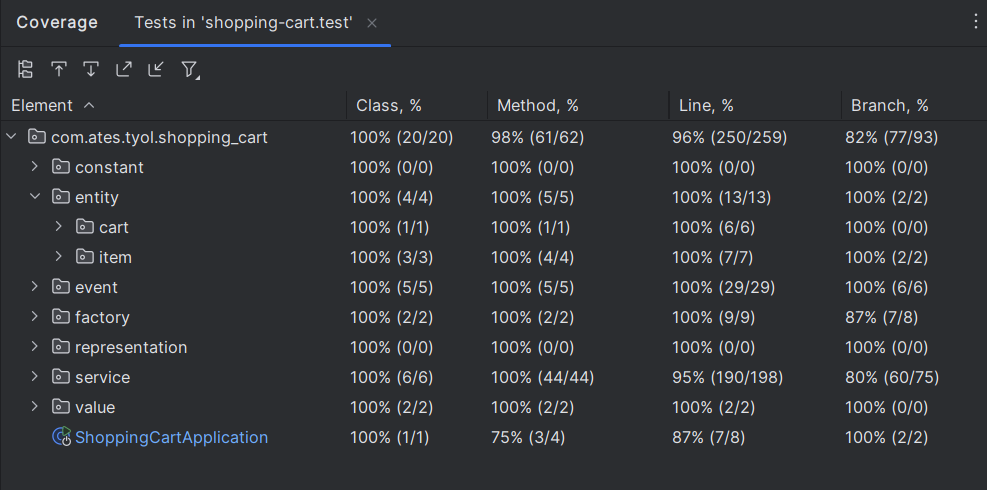

## **Shopping Cart Application**

### **Getting Started**
The **Shopping Cart Application** is a Command-Line Interface (CLI) tool that allows users to perform operations on a shopping cart, such as adding items, attaching value-added services (VAS), removing items, resetting the cart, and displaying its contents.

This application reads commands from an input file, processes them, and writes results to an output file.
The application adheres to Object-Oriented Design, Clean Code, SOLID principles, Design Patterns, Domain-Driven Design (DDD), and Test-Driven Development (TDD).

[readme.md](./readme.md)  file is the file that contains the necessary information about requirements.

In this file you will find the necessary information to run the application, the commands that can be used in the input file, and the outputs that will be written to the output file.

### Table of Contents
- [Application Flow](#application-flow)
- [How to Run the Application](#how-to-run-the-application)
- [Example Commands](#example-commands)
- [Example Input File](#example-input-file)
- [Applied Design Patterns and Principles](#applied-design-patterns-and-principles)
- [Tech Libraries](#tech-libraries)
- [Test Coverage](#test-coverage)

### Application Flow
The Shopping Cart Application starts **ShoppingCartApplication** and processes input file and commands from an input file and performs various operations on the shopping cart. Below is the detailed flow of the application:

1. **Initialization:**
   - The application starts by reading the input file specified by the user.
   - It initializes the necessary services and components, such as `FileService`, `CartService`, `EventFactoryService`, and promotion strategies.

2. **Command Processing:**
   - The application reads each command from the input file sequentially.
   - For each command, it identifies the type of event (e.g., addItem, removeItem, resetCart, displayCart).

3. **Execution:**
   - Based on the command type, the application performs the corresponding event:
      - **addItem:** Adds a specified item to the cart.
      - **addVasItemToItem:** Attaches a value-added service item to an existing item in the cart.
      - **removeItem:** Removes a specified item and its associated VasItems from the cart.
      - **resetCart:** Clears all items and resets the cart to its initial state.
      - **displayCart:** Displays the current contents of the cart, including items, total amount, applied promotions, and total discount.

4. **Validation:**
   - During each event, the application performs necessary validations to ensure business rules are followed (e.g., maximum quantity limits, price constraints, promotion applicability).

5. **Promotion Application:**
   - After processing all commands, the application checks for applicable promotions.
   - It applies the most advantageous promotion to the cart, ensuring the maximum discount for the customer.

6. **Output Generation:**
   - The application generates a response for each command, indicating the result (success or failure) and any relevant messages.
   - It writes the responses to the CLI and also to an `output.your_input_file_extension` file in the same directory as the input file.

### How to Run the Application

To run the application, follow these steps:

1. **Ensure you have Java installed:**
    - You need to have Java 21 or higher installed on your system. You can check your Java version by running:
      ```sh
      java -version
      ```

2. **Download the JAR file:**
    - Download the `shopping-cart-1.0.jar` file in the project main structure.

3. **Prepare the input file:**
    - Create an input file with the required commands. 
   For example, `input.json`.
      {"command":"addItem","payload":{"itemId":1,"categoryId":1001,"sellerId":2001,"price":100.0,"quantity":2}}

4. **Run the application:**
    - On Windows:
      ```sh
      java -jar shopping-cart-1.0.jar your_input_file_path 
      ```
        - For example:
      ```sh
      java -jar shopping-cart-1.0.jar "D:/workspace/input.json" 
      ```
      
    - On Mac/Linux:
      ```sh
      java -jar shopping-cart-1.0.jar your_input_file_path 
      ```

5. **Output:**
    - The response will be displayed on the CLI.
    - The response will also be written to `output.your_input_file_extension` in the same directory where the input file is located.

### Example Commands

**Add Item:**
```json
{"command":"addItem","payload":{"itemId":1,"categoryId":1001,"sellerId":2001,"price":100.0,"quantity":2}}
```

**Add Vas Item to Item:**
```json
{"command":"addVasItemToItem","payload":{"itemId":1,"vasItemId":2,"vasCategoryId":3242,"vasSellerId":5003,"price":10.0,"quantity":1}}
```

**Remove Item:**
```json
{"command":"removeItem","payload":{"itemId":1}}
```

**Reset Cart:**
```json
{"command":"resetCart"}
```

**Display Cart:**
```json
{"command":"displayCart"}
```

### Example Input File

```json
{"command":"addItem","payload":{"itemId":1,"categoryId":1001,"sellerId":2001,"price":100.0,"quantity":2}}
{"command":"addItem","payload":{"itemId":2,"categoryId":3004,"sellerId":2002,"price":200.0,"quantity":1}}
{"command":"addVasItemToItem","payload":{"itemId":1,"vasItemId":3,"vasCategoryId":3242,"vasSellerId":5003,"price":10.0,"quantity":1}}
{"command":"addVasItemToItem","payload":{"itemId":2,"vasItemId":4,"vasCategoryId":3242,"vasSellerId":5003,"price":20.0,"quantity":1}}
{"command":"removeItem","payload":{"itemId":1}}
{"command":"resetCart"}
```


### Applied Patterns and Principles
#### Design Patterns
- **Singleton Pattern:**
Used for managing the single instance of the CartService.
- **Factory Pattern:** 
Used for creating different types of items (DefaultItem, DigitalItem, VasItem).
- **Strategy Pattern:** 
Applied for different promotion strategies to calculate discounts.
- **Builder Pattern:**
Applied on representation classes to return.


#### SOLID Principles
- **Single Responsibility Principle:**
Each class has a single responsibility, e.g., CartService handles cart operations, ItemFactory handles item creation.
- **Open/Closed Principle:** 
The system is open for extension but closed for modification, e.g., new item types or promotions can be added without modifying existing code.
- **Liskov Substitution Principle:** 
Subtypes can replace their base types without altering the correctness of the program, e.g., DigitalItem and DefaultItem can be used interchangeably where Item is expected.
- **Interface Segregation Principle:** 
Clients are not forced to depend on interfaces they do not use, e.g., separate interfaces for different item operations.
- **Dependency Inversion Principle:** 
High-level modules do not depend on low-level modules but on abstractions, e.g., CartService depends on Item interface rather than concrete implementations.

#### Domain-Driven Design (DDD)
- **Entities:** The core objects of the domain, such as `Cart`, `Item`, `DigitalItem`, `DefaultItem`, and `VasItem`. Each entity has a unique identifier and encapsulates domain logic.
- **Value Objects:** Objects that describe some characteristics of a domain but do not have a unique identity, such as `ItemPayload` and `VasItemPayload`.
- **Aggregates:** A cluster of domain objects that can be treated as a single unit. The `Cart` is an aggregate root that contains `Item` entities.
- **Services:** Domain services that contain domain logic not naturally fitting within entities or value objects, such as `CartService`, `CartEventService`, `EventFactoryService`.
- **Factories:** Used for creating complex objects and aggregates, such as `ItemFactory`.
- **Domain Events:** Events that signify something important has happened in the domain, such as `ItemAdditionEvent` and `CartResetEvent`.

### Tech Libraries
- **Java 21**: For developing the application.
- **Spring Boot**: For building the application and managing dependencies.
- **Lombok**: For reducing boilerplate code.
- **JUnit**: For unit testing.
- **Mockito**: For mocking dependencies in tests.
- **Jackson**: For JSON parsing and serialization.
- **Gradle**: For build automation.

### Test Coverage
